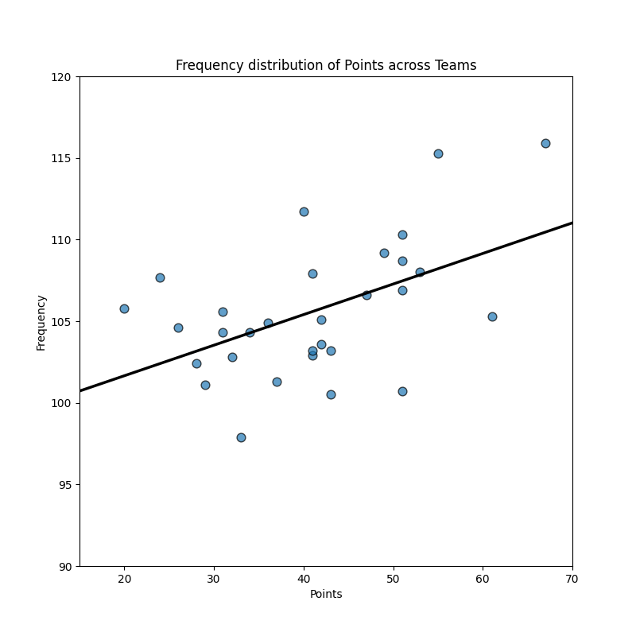
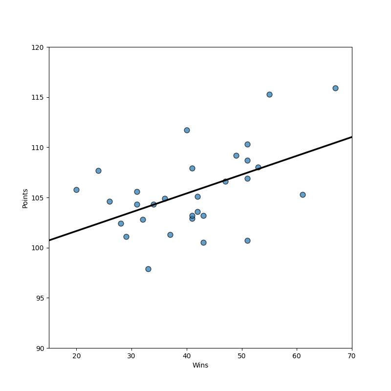

## Summary Statistics

|       |   games_played |   wins |   losses |   win_prop |   minutes |   points |   field_goals |   field_goals_attempted |   field_goals_prop |   points3 |   points3_attempted |   points3_prop |   free_throws |   free_throws_att |   free_throws_prop |   off_rebounds |   def_rebounds |   rebounds |   assists |   turnovers |    steals |   blocks |   block_fga |   personal_fouls |   personal_fouls_drawn |   plus_minus |
|:------|---------------:|-------:|---------:|-----------:|----------:|---------:|--------------:|------------------------:|-------------------:|----------:|--------------------:|---------------:|--------------:|------------------:|-------------------:|---------------:|---------------:|-----------:|----------:|------------:|----------:|---------:|------------:|-----------------:|-----------------------:|-------------:|
| count |             30 | 30     |   30     |  30        | 30        |  30      |      30       |                30       |           30       |  30       |            30       |       30       |      30       |          30       |           30       |        30      |       30       |   30       |  30       |    30       | 30        | 30       |   30        |         30       |               30       | 30           |
| mean  |             82 | 41     |   41     |   0.499967 | 48.3167   | 105.59   |      39.05    |                85.4167  |           45.72    |   9.65    |            27.0033  |       35.7167  |      17.8333  |          23.11    |           77.18    |        10.1333 |       33.3767  |   43.52    |  22.6267  |    13.96    |  7.71     |  4.74    |    4.74667  |         19.8933  |               19.9067  |  2.07242e-16 |
| std   |              0 | 11.188 |   11.188 |   0.136448 |  0.131525 |   4.1289 |       1.42581 |                 2.22944 |            1.36594 |   1.61965 |             4.11645 |        1.80308 |       1.55504 |           1.85869 |            2.77668 |         1.2313 |        1.17787 |    1.71653 |   2.21623 |     1.27051 |  0.656716 |  0.70886 |    0.644196 |          1.63537 |                1.06736 |  4.31261     |
| min   |             82 | 20     |   15     |   0.244    | 48.1      |  97.9    |      36.2     |                79.5     |           43.5     |   7.3     |            21       |       32.7     |      13.9     |          18.5     |           70.6     |         7.9    |       30.7     |   38.6     |  18.5     |    11.5     |  6.6      |  3.7     |    3.1      |         16.6     |               17.5     | -6.9         |
| 25%   |             82 | 32.25  |   31.5   |   0.393    | 48.2      | 102.975  |      38.15    |                84.4     |           44.75    |   8.65    |            24       |       34.225   |      17.025   |          22.1     |           74.85    |         9.025  |       32.675   |   42.825   |  21.125   |    13.3     |  7.125    |  4.125   |    4.375    |         18.875   |               19.325   | -2.7         |
| 50%   |             82 | 41     |   41     |   0.5      | 48.3      | 105      |      39.25    |                85.35    |           45.45    |   9.3     |            26.1     |       35.6     |      17.95    |          23.05    |           77.55    |        10.05   |       33.4     |   43.6     |  22.5     |    13.75    |  7.8      |  4.8     |    4.95     |         20       |               19.85    |  0           |
| 75%   |             82 | 50.5   |   49.75  |   0.616    | 48.4      | 107.85   |      39.575   |                87.1     |           46.675   |  10.375   |            28.75    |       37.2     |      19.075   |          24.2     |           79.4     |        11.05   |       34.325   |   44.375   |  23.775   |    14.95    |  8.2      |  5       |    5.2      |         20.775   |               20.4     |  2.4         |
| max   |             82 | 67     |   62     |   0.817    | 48.6      | 115.9    |      43.1     |                88.8     |           49.5     |  14.4     |            40.3     |       39.1     |      20.4     |          26.5     |           81.5     |        12.2    |       35.1     |   46.6     |  30.4     |    16.7     |  9.6      |  6.8     |    5.6      |         24.8     |               22.4     | 11.6         |

## Histogram

## Scatterplot
